# 00 — Portada

- **Alumno:** Jesús López Carrasco
- **Grupo:** ASIR1
- **Fecha:** 02/12/2025
- **Reto:** Reto 03 — Elementos internos de un sistema informático (UT2 · RA1)

  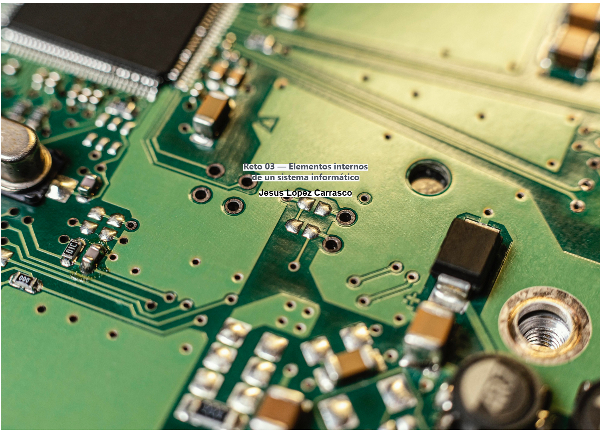

  # 01 — Índice
  1. [Portada](00-portada.md)
  2. [Introducción](02-introduccion.md)
  3. Parte 1 — Fuentes y Refrigeración  
     - [`10-parte1_fuentes_y_refrigeracion/tu_parte1.md`](10-parte1_fuentes_y_refrigeracion/tu_parte1.md)
  4. Parte 2 — Componentes y DDR5  
     - [`20-parte2/parte2_componentes.md`](20-parte2/parte2_componentes.md)
  5. Parte 3 — GPUs Black Friday  
     - [`30-parte3/parte3_gpus_blackfriday.md`](30-parte3/parte3_gpus_blackfriday.md)
  6. [ENTREGA ÚNICA](90-ENTREGA_UNICA.md)
  7. [Checklist](99-entrega_y_checklist.md)

# Parte 1 — Fuentes y Refrigeración

## Actividad A — Fuentes (ATX / SFX / TFX) en 3 tiendas

- Campos: marca/modelo · potencia (W) · 80 Plus · precio (€) · modularidad · PFC · dimensiones · URL · captura

### Tabla resumen comparativa (todas las tiendas)

|    Tienda    | Tipo | Marca/Modelo | W     | 80 PLUS                    | Modular | PFC        | Dimensiones                                  | Precio (€) | URL                                                                                                                                       |
| :-------------: | ------ | :------------: | ------- | ---------------------------- | --------- | ------------ | ---------------------------------------------- | ------------- | :------------------------------------------------------------------------------------------------------------------------------------------ |
| PcComponentes | ATX  |   Corsair   | 1000W | 80 PLUS GOLD               | ✅      | PFC ACTIVO | Largo: 140mm Ancho: 150mm  Alto:86mm   | 179,89€    | [Link](https://www.pccomponentes.com/fuente-alimentacion-corsair-rme-series-rm1000e-atx-31-pcie-51-1000w-cybenetics-80-plus-gold-modular) |
| PcComponentes | SFX  |   Corsair   | 850W  | 80 PLUS PLATINIUM          | ✅      | PFC ACTIVO | Largo: 100mm Ancho: 125mm Alto: 63,5mm | 181,12€    | [Link](https://www.pccomponentes.com/fuente-alimentacion-corsair-sf850-850w-sfx-80-plus-platinum-modular)                                 |
| PcComponentes | TFX  | Tacens Anima | 500W  | 85% de eficiencia (Bronze) | ❎      | NO         | Largo: 175mm Ancho: 85mm Alto: 65mm    | 22,64€     | [Link](https://www.pccomponentes.com/tacens-anima-aptii500p-fuente-alimentacion-tfx-500w-ultracompacta-85-smd-ventilador-80mm-negro)      |

## Actividad B — Refrigeración CPU

**- CPU de referencia: AMD Ryzen 5 7600X**
- **Comparacion Liquida vs Aire:** (precio, eficiencia térmica, ruido, extras). Incluye **URLs**.

  - **Refrigeracion liquida elegida:** Corsair NAUTILUS 360 RS Refrigeración Líquida 360mm Negro
    **URL:** [Link](https://www.pccomponentes.com/corsair-nautilus-360-rs-refrigeracion-liquida-360mm-negro?offer=2533f0c3-410a-4caa-abc4-ebdd964d16cb)
    **Precio:** 124,90€
    **Ruido:** 36 dBA
    **Eficiencia térmica:** Tiene un alto rendimiento con un radiador de 360mm, diseñado para ayudar a la CPU a alcanzar su maximo potencial
    **Extras:** Estetica bonita
    **Imagen:**
    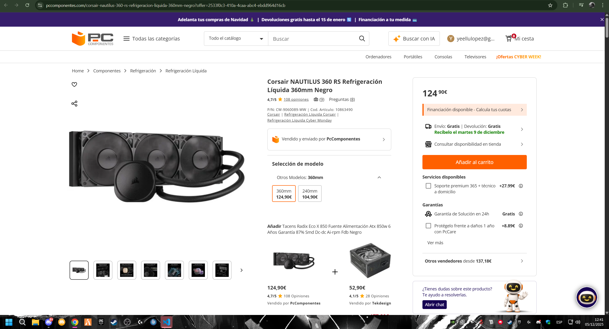
     
  - **Disipador elegido:** Be Quiet! Dark Rock 5 Ventilador CPU 6 Pipes 120mm Negro
    **URL:** [Link](https://www.pccomponentes.com/ventilador-cpu-be-quiet-dark-rock-5-ventilador-cpu-6-pipes-120mm-negro?offer=c3965442-87ba-48fb-88da-5aa16975b430)
    **Precio:** 66,99€
    **Ruido:** 11,9 a 29,8 dB
    **Eficiencia térmica:** Tiene un excelente para CPUs de media/alta gama
    **Extras:** 6 tubos tubos dispadores de cobre
    **Imagen:** 

    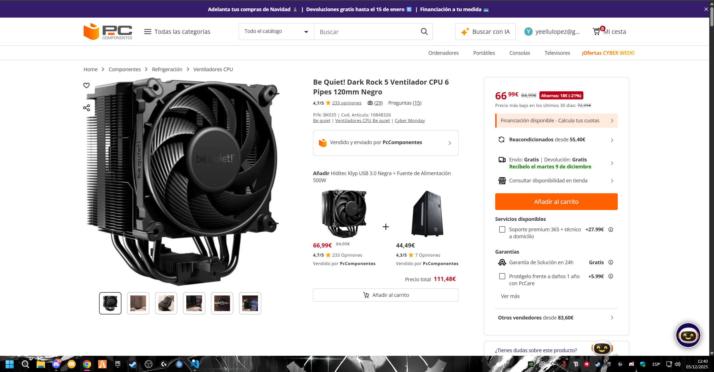 

### Comparativa resumida

| Sistema | Modelo                  | Precio (€) | TDP soportado / Rendimiento                                | Ruido                                | Extras                            | URL                                                                                                                                                     |
| --------- | ------------------------- | ------------: | ------------------------------------------------------------ | -------------------------------------- | ----------------------------------- | --------------------------------------------------------------------------------------------------------------------------------------------------------- |
| Liquida | Corsair NAUTILUS 360 RS |   124,90 € | Radiador de 360mm (Alto rendimiento para CPUs entusiastas) | 36 dBA (Ventiladores) / Bomba 20 dBA | Estetica bonita                   | [Link](https://www.pccomponentes.com/corsair-nautilus-360-rs-refrigeracion-liquida-360mm-negro?offer=2533f0c3-410a-4caa-abc4-ebdd964d16cb)              |
| Aire    | be quiet! Dark Rock 5   |    66,99 € | 210 W TDP (Excelente rendimiento para alta gama)           | 29,8 dB (Máx.)                      | 6 tubos tubos dispadores de cobre | [Link](https://www.pccomponentes.com/ventilador-cpu-be-quiet-dark-rock-5-ventilador-cpu-6-pipes-120mm-negro?offer=c3965442-87ba-48fb-88da-5aa16975b430) |

## Conclusión Parte 1

**Comparativa:**

La decisión entre optar por la refrigeración líquida o el disipador de aire depende fundamentalmente del presupuesto, la preferencia en cuanto a niveles de ruido y la necesidad de rendimiento extremo. El Corsair resulta notablemente más costoso (casi el doble), aunque su radiador de 360 mm proporciona la capacidad máxima de enfriamiento para procesadores de alta gama y overclocking intensivo, si bien puede emitir un sonido más elevado (hasta 36 dBA) bajo carga. Por otro lado, el disipador es la opción inteligente y silenciosa: es mucho más asequible, ofrece un rendimiento excelente (210W TDP), y es notablemente más silencioso (máximo 29.8 dB), siendo ideal para cualquier usuario que busque una refrigeración robusta y duradera con cero mantenimiento y la mínima interferencia sonora.

- **Conclusión por perfil: Aire**
  Es una buena opcion si buscas buen rendimiento sin gastar demasiado dinero en ello, buena eleccion para el ambito gaming ya que ofrece un buen rendimiento.Para un diseñador no es tan buena opcion ya que los disipadores no suelen tener tan buena eficiencia térmica como las refrigeraciones liquidas.
- **Conclusión por perfil: Liquida**
  Esta refrigeracion liquida es una buena eleccion tanto para el ambito gamer y el de un diseñador que utiliza un software de renderizado intensivo. Al tener ese radiador de 360mm le saca el mayor provecho al procesador.

# Parte 2 — Componentes y DDR5 (archivo único)

## 1) Búsqueda de componentes
Para cada uno: **marca/modelo**, **características**, **precio**, **URL**, **captura**, **justificación**.

### RAM oficina
- **Marca/Modelo:** Adata Premier
- **Capacidad/Velocidad/Tipo:** 8 GB / 2666 MHz / DDR4
- **Precio:** 57,92€
- **URL:** [Link](https://www.pccomponentes.com/adata-premier-ddr4-2666mhz-pc4-21300-8gb-cl19?)
- **Captura:** 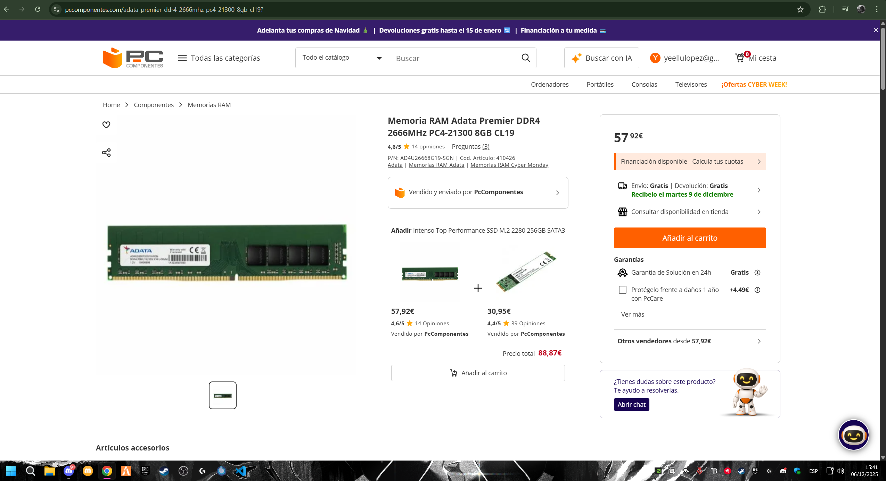
- **Justificación:** Es una opcion economica y de una marca fiable y reconocible suficiente para trabajos tipicos de oficina.

### RAM gaming
- **Marca/Modelo:** G.SKILL Trident Z5 NEO RGB (AMD EXPO)
- **Capacidad/Velocidad/Tipo:** 32 GB (2 x 16 GB) / 6000 MHz / DDR5
- **Precio:** 429,95€
- **URL:** [Link](https://www.pccomponentes.com/gskill-trident-z5-neo-rgb-ddr5-6000mhz-32gb-2x16gb-cl30?srsltid=AfmBOorcX-OYqfJEgewVGFiX2TIW0UqJztuvCRC6nkqdKDN-e7zk7X03)
- **Captura:** 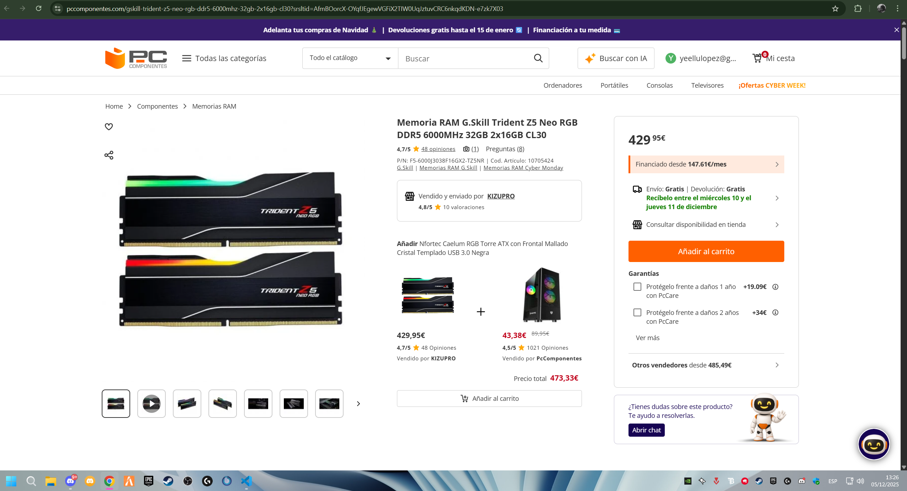
- **Justificación:** La velocidad de 6000 MHz con la tecnologia DDR5 es la combinacion de alta gama, esta combinacion minimiza el tiempo de acceso de datos. Tambien las RAMs de G.SKILL Trident son increiblemente valoradas por su bonita estetica.

### CPU oficina
- **Marca/Modelo:** Intel Pentium Gold G7400
- **Núcleos/Hilos/Frecuencia:** 2 Nucleos / 4 Hilos / Frecuencia base de 3.5 GHz
- **TDP/Gráfica integrada (si aplica):** 46W / Grafica integrada (Intel UHD Graphics 710)
- **Precio:** 94,99€
- **URL:** [Link](https://www.pccomponentes.com/intel-pentium-gold-g7400-37-ghz)
- **Captura:** 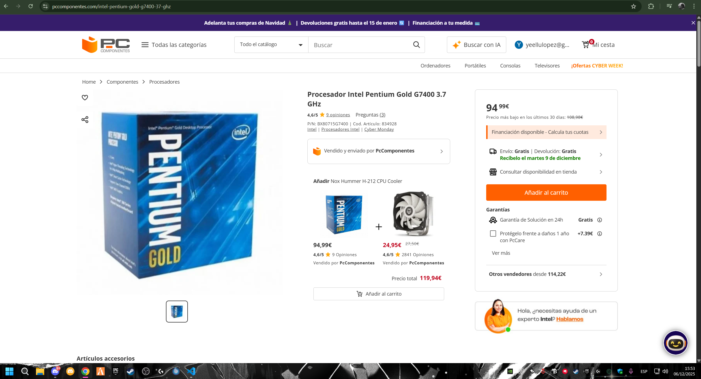
- **Justificación:** Es una opcion barata y fiable con suficientes nucleos e hilos para navegar y utilizar el tipico software de oficina como office, excel, etc.

### CPU gaming
- **Marca/Modelo:** AMD Ryzen 7 7800X3D.
- **Núcleos/Hilos/Frecuencia:** 8 Nucleos / 16 Hilos / Frecuencia base de 4.2 GHz.
- **TDP:** 120W
- **Precio:** 379,90€
- **URL:** [Link](https://www.pccomponentes.com/amd-ryzen-7-7800x3d-42-ghz-5-ghz)
- **Captura:** 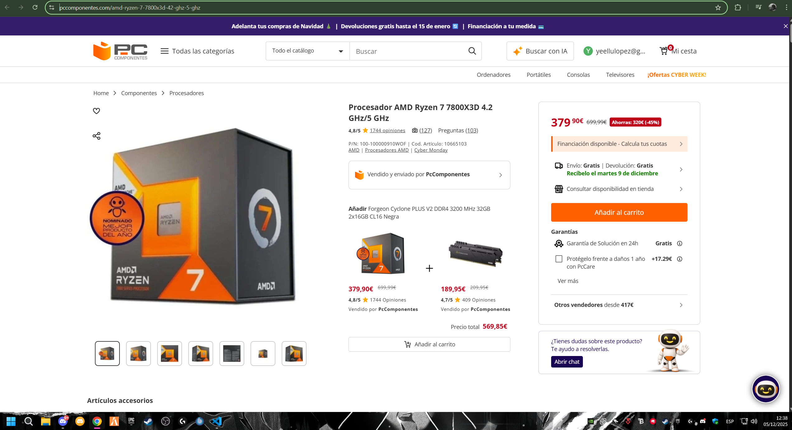
- **Justificación:** Actualmente es uno de los procesadores mas potentes del mercado, con tecnologia 3D V-Cache. Ideal para resoluciones altas como QHD o 4K.

## 2) Tabla comparativa RAM (DDR4 vs DDR5)
| Atributo | DDR4 | DDR5 |
|---|---|---|
| Velocidad |Más lenta (Típicamente 2133 a 3200 MT/s)  | Más rápida (Típicamente 4800 a 8400 MT/s o más) |
| Consumo |Mayor voltaje (1.2 V), menor eficiencia energética  | Menor voltaje (1.1 V), mayor eficiencia energética (con chip de gestion de energia propio) |
| Precio |Generalmente mas economica  | Generalmente mas costosas  |
| Compatibilidad |Placa base con ranuras DDR4  |Placa base con ranuras DDR5   |

## 3) Investigación DDR5
- **Ventajas respecto a DDR4:** Cuenta con mayor velocidad y ancho de banda, tiene una mayor eficiencia energetica operando a un voltaje mas bajo y tiene **PMIC** (circuito integrado de gestion de energia) en el propio modulo, tambien incorpora una funcion de correcion de errores en el chip que mejora la fiabilidad
- **Usos principales donde más se nota:**
    - Informatica de alto rendimiento: Se requiere el máximo ancho de banda y rendimiento para el procesamiento de datos.
    - Inteligencia artificial y Machine Learning: Entrenamiento de modelos que trabajan con grandes volúmenes de datos.
    - Multitarea extrema y maquinas virtuales: Alojar múltiples máquinas virtuales o ejecutar simultáneamente muchos programas exigentes, beneficiándose del mayor ancho de banda y capacidad.
    - Creacion de contenido profesional: Tareas intensivas de memoria y computación, como renderizado 3D, edición de video en alta resolución y animación.
- **Ejemplo de dispositivo/situación especialmente ventajosa:**
    - Una estacion de trabajo o servidor con requisitos de alta capacidad:Gracias a la capacidad de admitir hasta 256 GB por módulo y la corrección de errores integrada, la DDR5 es ideal para servidores que necesitan manejar grandes bases de datos o centros de datos que requieren máxima escalabilidad y confiabilidad.
    - Un pc gamer de ultima generacion con GPU de alta gama (Series 4080/4090 o 5080/5090): La DDR5 garantiza que la CPU no sea un cuello de botella para la tarjeta gráfica, permitiendo que esta última trabaje a su máximo potencial para obtener mayores tasas de FPS y fluidez en juegos modernos y futuros.

# Parte 3 — GPUs y precios reales (Black Friday 2025)
> Vídeo: **“Mejores Tarjetas Gráficas Calidad - Precio | TOP GPUs GAMING Black Friday 2025”**  
> URL: https://www.youtube.com/watch?v=ILOtkTXLUvg

## 0) Portada
- Alumno/a: Jesus Lopez Carrasco
- Grupo: ASIR1  
- Fecha: 05/12/2025

## 1) Introducción (5–10 líneas)
El chico del video habla de las mejores tarjetas graficas que se pueden comprar en relacion precio/rendimiento en la ultima semana de rebajas del black friday de este año. Habla tanto como graficas Nvidia, AMD e incluso INTEL, haciendole pruebas de rendimiento y dependiendo de tu presupuesto y lo que te venga bien te ayuda a elegir una de ellas.Las pruebas de rendimiento se centran en el framerate, la importancia de la memoria VRAM (8 GB, 16 GB) y la calidad de tecnologías exclusivas como el Ray Tracing, DLSS y FSR. Primero haremos una lista de las graficas que habla entre los rangos de precio de 350€ y de 600€-800€, luego verificaremos el precio de real actual en PcComponentes y las compararemos para verificar cual es la tarjeta grafica que se deberia comprar respecto a su calidad y precio.

## 2) Tramos del vídeo y modelos mencionados
### 2.1 Tramo ~350 €
- Minuto inicio–fin: **07:43 – 09:30**
- GPUs citadas (2): **AMD RADEON RX 9060 XT 16GB GDDR6**, **GeForce RTX 5060 Ti 8GB GDDR7 DLSS4**

### 2.2 Tramo 600–800 €
- Minuto inicio–fin: **11:36 – 14:06**
- GPUs citadas (2): **AMD RADEON RX 9070 XT 16GB GDDR6 FSR4**, **GeForce RTX 5070 Ti 16GB Reflex 2 RTX AI DLSS4**

**¿Se repite algún modelo entre tramos?**
Si, hay varios modelos que se repiten pero suelen cambiar varias tecnologias como la capacidad de vram, dlss, gddr, etc...

## 3) Precios reales en tiendas
> Inserta imágenes en `assets/img/30-parte3/` y enlaza con ruta relativa.

### 3.1 GPU del tramo 350 € — Modelo A
- Tienda: PcComponentes
- Nombre exacto en tienda: Tarjeta Gráfica Sapphire PULSE AMD Radeon RX 9060 XT 16GB GDDR6 FSR 4 (Actualmente solo disponible reacondicionada)
- Precio (€): 397,20€
- URL: [Link](https://www.pccomponentes.com/tarjeta-grafica-sapphire-pulse-amd-radeon-rx-9060-xt-16gb-gddr6-fsr-4?refurbished)
- Imagen:
 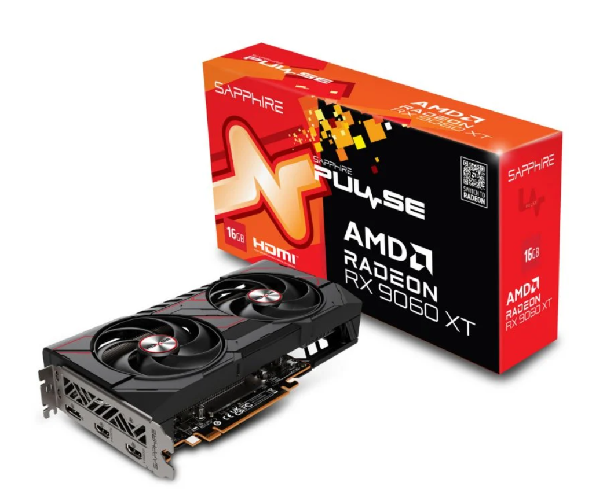

### 3.2 GPU del tramo 350 € — Modelo B
- Tienda: PcComponentes
- Nombre exacto en tienda: Tarjeta Gráfica ASUS Dual GeForce RTX 5060 OC Edition 8GB GDDR7 Reflex 2 RTX AI DLSS4
- Precio (€): 336,19€
- URL: [Link](https://www.pccomponentes.com/tarjeta-grafica-asus-dual-geforce-rtx-5060-oc-edition-8gb-gddr7-reflex-2-rtx-ai-dlss4?utm_source=790799&utm_medium=afi&utm_campaign=www.youtube.com&sv1=affiliate&sv_campaign_id=790799&awc=20982_1765054721_6a5a4f6b8ff7a08473d6870be7a29a97&utm_term=deeplink&utm_content=)
- Imagen: 
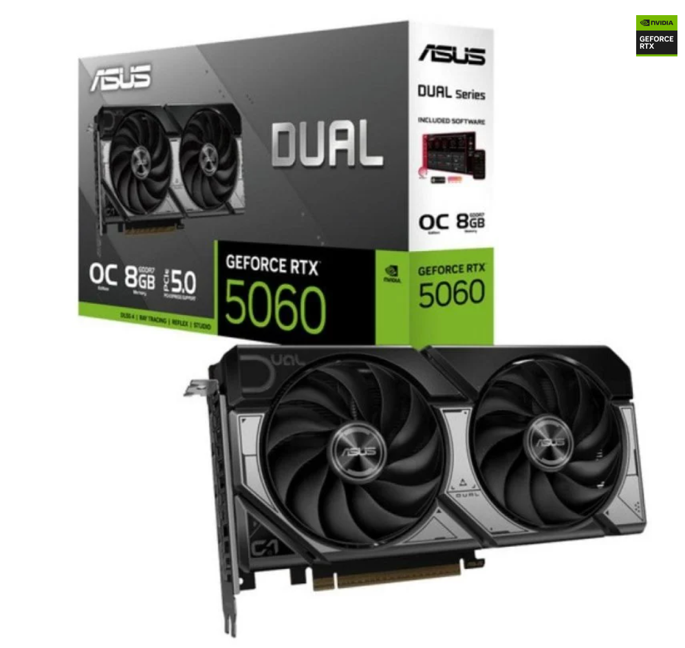

### 3.3 GPU del tramo 600–800 € — Modelo C
- Tienda: PcComponentes
- Nombre exacto en tienda: Tarjeta Gráfica XFX SWIFT AMD Radeon RX 9070 XT Triple Fan 16GB GDDR6 FSR 4
- Precio (€): 735,41€
- URL: [Link](https://www.pccomponentes.com/tarjeta-grafica-xfx-swift-amd-radeon-rx-9070-xt-triple-fan-16gb-gddr6-fsr-4?utm_source=790799&utm_medium=afi&utm_campaign=www.youtube.com&sv1=affiliate&sv_campaign_id=790799&awc=20982_1765054837_a25219654d2688972c92fcf3fca8c172&utm_term=deeplink&utm_content=)
- Imagen: 
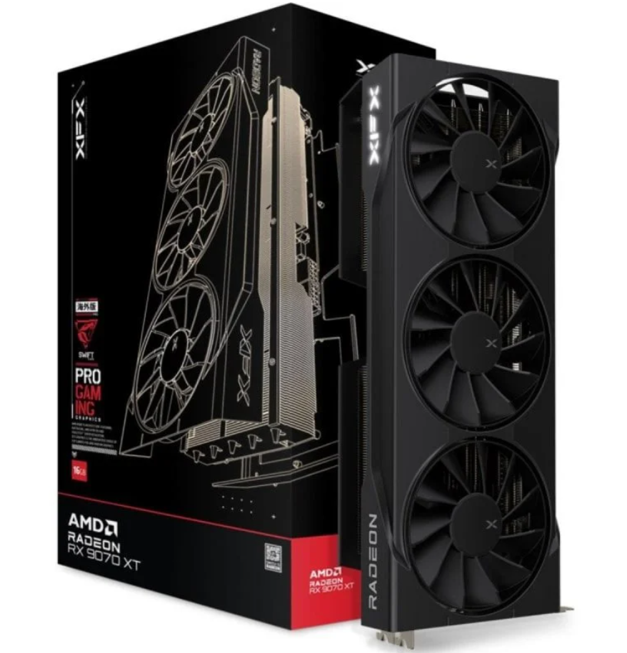

### 3.4 GPU del tramo 600–800 € — Modelo D
- Tienda: PcComponentes
- Nombre exacto en tienda: Tarjeta Gráfica PNY GeForce RTX 5070 Ti 16GB GDDR7 Reflex 2 RTX AI DLSS4
- Precio (€): 450,77€ 
- URL: [Link](https://www.pccomponentes.com/tarjeta-grafica-pny-geforce-rtx-5070-ti-16gb-gddr7-reflex-2-rtx-ai-dlss4?utm_source=790799&utm_medium=afi&utm_campaign=www.youtube.com&sv1=affiliate&sv_campaign_id=790799&awc=20982_1765054924_87a1512864579bde6f83972b2e075244&utm_term=deeplink&utm_content=)
- Imagen:
 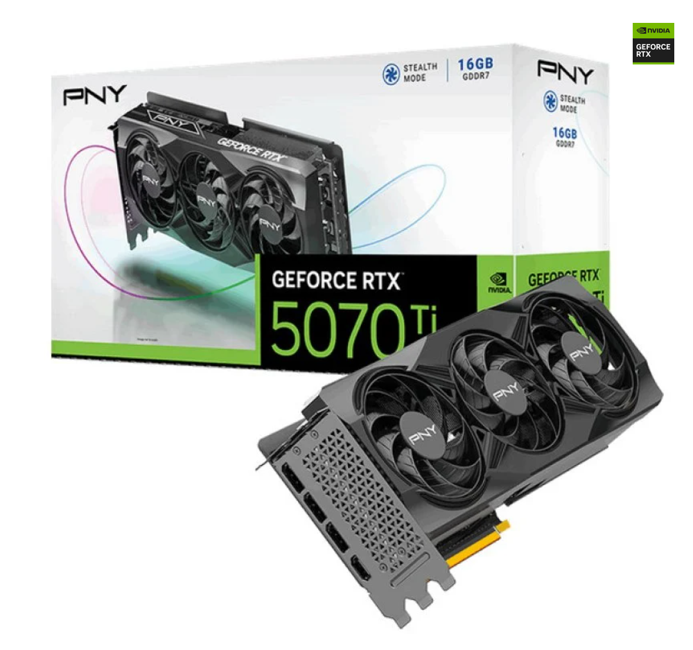

> Nota: Si no encuentras el mismo **ensamblador**, indica la diferencia manteniendo la misma **GPU**.

## 4) Tabla comparativa (precios reales)
| Tramo (vídeo) | GPU (modelo del vídeo) | Tienda | Precio (€) | URL | Imagen |
|---|---|---|---:|---|---|
| 350 € | AMD RADEON RX 9060 XT 16GB GDDR6 | PcComponentes | 397,20€ | [Link](https://www.pccomponentes.com/tarjeta-grafica-sapphire-pulse-amd-radeon-rx-9060-xt-16gb-gddr6-fsr-4?refurbished) | *(insertar abajo)* |
| 350 € | GeForce RTX 5060 Ti 8GB GDDR7 DLSS4 | PcComponentes | 336,19€ | [Link](https://www.pccomponentes.com/tarjeta-grafica-asus-dual-geforce-rtx-5060-oc-edition-8gb-gddr7-reflex-2-rtx-ai-dlss4?utm_source=790799&utm_medium=afi&utm_campaign=www.youtube.com&sv1=affiliate&sv_campaign_id=790799&awc=20982_1765054721_6a5a4f6b8ff7a08473d6870be7a29a97&utm_term=deeplink&utm_content=) | *(insertar abajo)* |
| 600–800 € |AMD RADEON RX 9070 XT 16GB GDDR6 FSR4 | PcComponentes | 735,41€ | [Link](https://www.pccomponentes.com/tarjeta-grafica-xfx-swift-amd-radeon-rx-9070-xt-triple-fan-16gb-gddr6-fsr-4?utm_source=790799&utm_medium=afi&utm_campaign=www.youtube.com&sv1=affiliate&sv_campaign_id=790799&awc=20982_1765054837_a25219654d2688972c92fcf3fca8c172&utm_term=deeplink&utm_content=) | *(insertar abajo)* |
| 600–800 € | GeForce RTX 5070 Ti 16GB Reflex 2 RTX AI DLSS4 | PcComponentes | 450,77€ | [Link](https://www.pccomponentes.com/tarjeta-grafica-pny-geforce-rtx-5070-ti-16gb-gddr7-reflex-2-rtx-ai-dlss4?utm_source=790799&utm_medium=afi&utm_campaign=www.youtube.com&sv1=affiliate&sv_campaign_id=790799&awc=20982_1765054924_87a1512864579bde6f83972b2e075244&utm_term=deeplink&utm_content=) | *(insertar abajo)* |

**Modelo A:**

**Modelo B:**

**Modelo C:**

**Modelo D:**

## 5) Conclusión (5–8 líneas)
- ¿Los precios reales se parecen a lo que sugiere el vídeo?
No se parecen ya que el video es de las ofertas de black friday y la mayoria de ellas ya no estan en oferta
- ¿Cuál de las cuatro ofrece mejor **calidad-precio** y por qué?  
La mejor opcion calidad-precio es la GeForce RTX 5070 Ti 16GB, ya que tiene un precio de 450€ que se situa cerca del precio de una tarjeta grafica de gama media. Hay que tener en cuenta que tiene un total de **16GB de vram** y es una muy buena cantidad para tener un muy buen rendimiento en videojuegos, tambien dispone de las tecnologias de **DLLS4** y **Reflex 2 AI** que le mejoran el rendimiento muchisimo.
- Observaciones finales.
En general, la tabla muestra que los rangos de precios del video son informativos, pero en las rebajas es esencial no ocuparse con rangos teóricos, sino comparar los reales, ya que algunos modelos, probablemente bajos de la oferta, serán descontados muy por debajo de la gama teórica. A, Además, la RTX 5070 Ti incluso a este precio en mi opinión, es una gran compra, si su rango real mantiene.
## 6) Fuentes
- Tiendas: enlaces listados arriba.  
- Vídeo: URL al inicio del documento.
